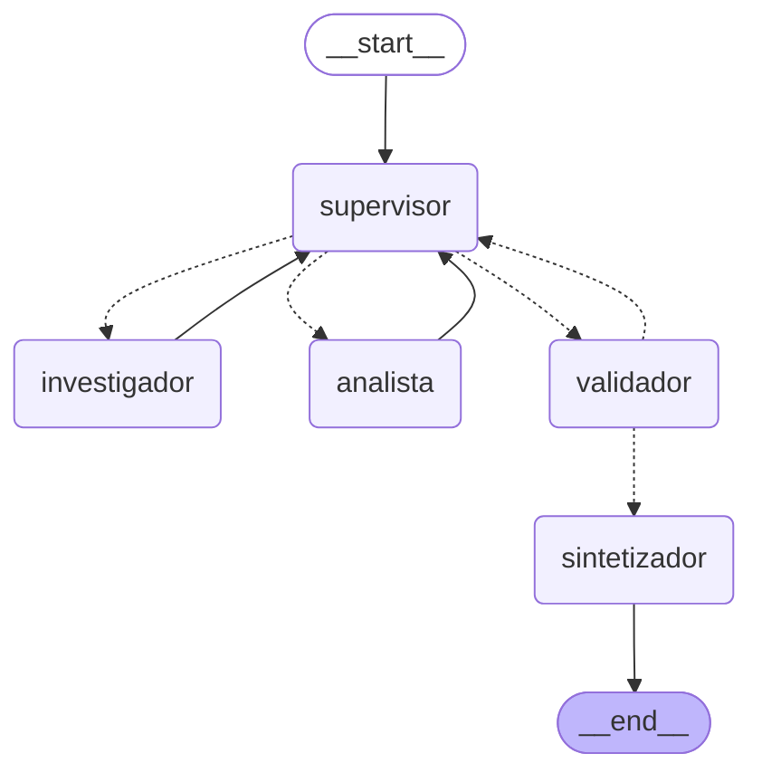

# Pre-entrega 6 — Orquestador multi-agente especializado

Orquestador jerárquico con LangGraph: un **supervisor** enruta el trabajo a dos
**especialistas** de dominios distintos, un **validador** verifica que el
trabajo esté completo antes de cerrar, y un **sintetizador** redacta el informe
final.

El dominio es una auditoría técnica. La consulta de demostración necesita las
dos especialidades y no se puede responder con ninguna sola:

> *Nuestros servicios asíncronos se vienen cayendo seguido. ¿Qué dice nuestra
> documentación técnica sobre las causas más probables, y qué muestran nuestros
> propios incidentes del último año? Quiero saber cuál es la causa dominante y
> si hay algún caso fuera de lo normal.*

La primera mitad es **búsqueda semántica** sobre el índice de Pinecone de la
Pre-entrega 4. La segunda es **consulta a una base y cómputo estadístico** sobre
20 incidentes de producción. El informe tiene valor solo si alguien conecta las
dos: eso es lo que hace el orquestador.

---

## Qué cumple de la consigna

| Requerimiento | Dónde está |
|---|---|
| Topología jerárquica con supervisor como router | [`graph.py`](graph.py), [`agents/supervisor.py`](agents/supervisor.py) |
| ≥2 especialistas con dominios distintos | [`agents/research_agent.py`](agents/research_agent.py) (recuperación), [`agents/analyst_agent.py`](agents/analyst_agent.py) (cómputo) |
| Agente de búsqueda con fuente externa | Pinecone de la Pre-entrega 4 + base de incidentes |
| Agente de análisis/cómputo | estadísticas, detección de atípicos por IQR, validación de esquema |
| Estado compartido estructurado con trazabilidad | `Hallazgo` en [`state.py`](state.py) |
| `StateGraph` con estado que hereda de `MessagesState` | `EstadoOrquestador` en [`state.py`](state.py) |
| Aristas condicionales con `Literal` en el retorno | `enrutar_desde_supervisor`, `enrutar_desde_validador` |
| El supervisor decide si está completo o hay que refinar | rúbrica de 4 condiciones + ciclo `validador -> supervisor` |
| Nodo de validación | `nodo_validador`, determinista |
| Freno contra el supervisor infinito | `MAX_PASOS_SUPERVISOR` + `recursion_limit` |
| Contaminación de contexto evitada | `InjectedState` + instrucción puntual por especialista |
| Diagrama Mermaid del grafo | más abajo, generado con `draw_mermaid()` |
| Notebook demostrando la delegación | [`demo.ipynb`](demo.ipynb), con outputs reales |
| Tests automatizados (corrección de la entrega 5) | [`tests/`](tests/), 26 tests sin red ni API keys |

---

## El grafo



Las líneas punteadas son las aristas condicionales. Se regenera con:

```bash
python main.py --diagrama
```

Se usa `draw_mermaid()` y no `draw_mermaid_png()` a propósito: el texto se
versiona y se revisa en un diff, un PNG no. Y como el diagrama sale del grafo
compilado, si alguien agrega un nodo y se olvida de actualizar el README, el
diagrama regenerado lo delata.

### Los dos ciclos

1. **`supervisor -> especialista -> supervisor`** — el ciclo de trabajo. Cada
   vuelta suma hallazgos al estado.
2. **`validador -> supervisor`** — el ciclo de refinamiento. Si el trabajo no
   está completo, el flujo vuelve en lugar de responder a medias.

---

## Por qué esta topología

### Jerárquica y no colaborativa

Los especialistas **nunca** deciden quién sigue: siempre devuelven el control al
supervisor. La alternativa —que cada agente elija a quién pasarle la pelota—
tiene dos problemas concretos:

- **No hay dónde poner el freno.** Con un supervisor único, el tope de pasos se
  chequea en un solo lugar. Con delegación entre pares, cada agente necesitaría
  su propio presupuesto y habría que razonar sobre la suma.
- **No hay dónde poner la rúbrica.** La decisión de "esto ya está" tiene que
  tomarse mirando el estado completo. Un especialista que solo ve su parte no
  está en posición de decidirlo.

El costo de la jerarquía es una llamada extra al modelo por vuelta. A cambio, el
flujo es auditable: la traza dice quién decidió qué y por qué.

### Supervisor y validador hacen cosas distintas

La consigna pide un nodo de validación **o** una rúbrica en el prompt del
supervisor. Están las dos, y no es redundancia:

- La **rúbrica del supervisor** es su *intención*. El modelo evalúa qué falta y
  decide a quién mandar.
- El **validador** es la *verificación*. Recorre `hallazgos` y comprueba qué
  herramientas corrieron efectivamente. **No usa LLM**: es Python puro, mismo
  estado, misma respuesta, siempre.

Si el supervisor dijera "ya está completo" sin haber pasado por el analista, el
validador lo detecta y lo devuelve, porque no le cree al modelo: le cree al
estado. Un validador implementado como un LLM preguntándole a otro LLM si
estuvo bien agrega una opinión, no una garantía.

Esa asimetría es la defensa contra el modo de falla más común de un
orquestador, que no es el bucle eterno sino **el cierre prematuro**.

### Cómo se manejan los conflictos entre agentes

En este diseño los agentes no pueden contradecirse sobre los datos, y es por
construcción:

- **Los dominios no se solapan.** El investigador recupera y no calcula; el
  analista calcula y no recupera. No hay dos agentes produciendo la misma
  métrica con métodos distintos.
- **Hay una sola fuente de verdad.** Los números viven en `Hallazgo.datos`, tal
  como los devolvió la herramienta. El analista los lee de ahí, no de lo que el
  investigador contó en su mensaje. No hay copia que pueda divergir del
  original.
- **Los desacuerdos sobre el *proceso* los resuelve el supervisor.** Si el
  analista dice "no tengo datos" y la rúbrica dice que `listar_incidentes`
  corrió, el supervisor ve las dos cosas y decide. La jerarquía existe
  justamente para que haya alguien que decida.
- **Los desacuerdos sobre si *terminar* los resuelve el validador**, y los
  resuelve contra el estado, no por consenso.

Queda un conflicto que el diseño **no** resuelve y conviene decirlo: si una
herramienta devolviera un dato incorrecto, nadie lo detectaría. `validar_registros`
verifica el *esquema* (que los minutos no sean negativos, que la severidad esté
en el vocabulario), no la *veracidad*. Es la razón por la que el informe final
declara la tasa de validez en vez de esconderla.

---

## Decisiones de diseño

### `InjectedState`: los datos no pasan por el prompt

Las tres herramientas del analista reciben los incidentes por `InjectedState`,
no como argumentos que el LLM tenga que escribir. El modelo decide *cuándo*
llamar a `resumir_incidentes`, pero no le dicta los 20 registros: LangGraph los
inyecta desde el estado compartido.

La alternativa es que los registros viajen como texto en el prompt, y tiene tres
costos:

1. **Precisión.** Un LLM que transcribe 20 filas de números se equivoca en
   alguna, y una media calculada sobre datos mal transcriptos es una media mal
   calculada que *parece* bien.
2. **Contexto.** 20 registros son ~2.000 tokens que se repetirían en cada
   vuelta. Con `InjectedState`, el prompt del analista no crece con el tamaño
   del dataset.
3. **Trazabilidad.** El número del informe se puede rastrear hasta la fila de la
   base. Si pasó por un prompt, no.

El LLM queda haciendo lo que hace bien —decidir qué análisis corresponde e
interpretar el resultado— y la aritmética la hace Python, que no alucina.

Hay un test que lo blinda: [`test_el_analista_recibe_los_datos_sin_que_pasen_por_el_prompt`](tests/test_orquestador.py)
verifica que el analista calcule sobre 6 incidentes y que **ningún id de
incidente aparezca en el prompt**. Si alguien "simplifica" esto pasando los
datos por el mensaje, el test lo detecta.

### Los especialistas no reciben el historial

Un especialista recibe exactamente dos cosas: la solicitud original como marco,
y la instrucción puntual que le escribió el supervisor. No ve las
deliberaciones del supervisor, ni los razonamientos del otro especialista, ni
los payloads que ya están en el estado.

Por eso `DecisionSupervisor.instruccion` tiene un validador que rechaza
instrucciones vacías: si el supervisor no escribe una tarea autosuficiente, el
especialista se queda sin saber qué hacer, y falla en la validación de Pydantic
antes de desperdiciar una llamada al modelo.

El supervisor, a su vez, no ve los payloads completos: ve **una línea de resumen
por hallazgo** (`_resumir_hallazgo` en [`utils.py`](utils.py)). Su prompt tiene
tamaño constante independientemente de cuántos datos se hayan recolectado.

También está testeado:
[`test_el_especialista_no_ve_el_historial_de_la_conversacion`](tests/test_orquestador.py)
planta un mensaje en el historial y verifica que no llegue al prompt.

### Dos frenos independientes contra el supervisor infinito

- **`MAX_PASOS_SUPERVISOR`** (6) es el freno *semántico*. Se chequea **antes**
  de llamar al modelo: un tope que se evalúa después de pagar la llamada no
  ahorra nada. Al alcanzarlo, el supervisor deja de poder derivar y el flujo va
  directo a cerrar con lo que haya.
- **`recursion_limit`** (25) es el freno *estructural* de LangGraph. Si algo
  falla de un modo que ni siquiera deja contar pasos, corta con
  `GraphRecursionError`.

El primero produce una **respuesta degradada y declarada como parcial**; el
segundo, un error. Hacen falta los dos: uno protege la experiencia, el otro
protege la factura.

Cuando se agota el presupuesto con la rúbrica incompleta, el validador aprueba
igual y lo deja asentado, y el sintetizador recibe la instrucción de decir que
el informe es parcial. Responder a medias y admitirlo es mejor que no responder.

### El `Literal` se comparte entre el estado, el modelo y el ruteo

`Destino = Literal["investigador", "analista", "validador"]` se usa en tres
lugares: el campo del estado, la salida estructurada del supervisor y el tipo de
retorno de la función de ruteo. Consecuencias:

- El modelo **no puede inventar** un nodo que no existe: Pydantic rechaza la
  decisión antes de que llegue al grafo.
- LangGraph valida los destinos al compilar, así que un nombre mal escrito falla
  ahí y no a mitad de una corrida.

### El supervisor devuelve salida estructurada, no texto

`with_structured_output(DecisionSupervisor)`. El ruteo no depende de parsear una
frase, y la decisión viene con su razonamiento y su rúbrica en campos separados,
que es lo que después hace legible la traza.

Detalle: lo que se **guarda** en el estado es la rúbrica *verificada* contra las
herramientas que corrieron, no la que declaró el modelo. En el estado queda el
hecho comprobable.

### La búsqueda documental tiene respaldo local

El investigador consulta el índice de Pinecone de la Pre-entrega 4. Pinecone es
un servicio remoto con una API key que puede rotarse o vencerse, así que si no
responde la herramienta **no falla**: cae a un índice BM25 local sobre los
mismos archivos del corpus, y lo declara en el campo `fuente_de_busqueda` de su
respuesta.

Un orquestador que se cae entero porque una de cinco herramientas perdió la
credencial no es un orquestador, es una cadena.

Ese respaldo tiene un segundo uso: los tests fuerzan esa ruta, y así ejercitan
la herramienta real sin una sola llamada de red.

### Los tipos del estado están registrados en el serializador

El estado lleva modelos Pydantic propios (`Hallazgo`, `Rubrica`). El
serializador de LangGraph los deserializa igual por defecto, pero emite un
warning por cada uno y avisa que en una versión futura va a **bloquearlos** —
momento en el que el orquestador no podría releer sus propios checkpoints.

Dos detalles que no son obvios y costaron encontrar:

- `with_msgpack_allowlist()` **no sirve** acá: si la allowlist base es la
  permisiva (que es el default), ese método devuelve el mismo objeto sin tocar
  nada. Hay que pasar la allowlist al constructor.
- Declarar una allowlist explícita **no rompe el resto**: los tipos de
  LangChain están en la lista de tipos seguros incorporada.

Hay un test que corre el grafo contra un SQLite real y falla si aparece el
warning. La primera versión de ese test no servía, porque capturaba `warnings`
de Python y el aviso sale por `logging`.

### `create_react_agent` está deprecado y se usa igual

LangGraph 1.x avisa que se movió a `langchain.agents.create_agent`. Se mantiene
`create_react_agent` porque es lo que nombra la consigna explícitamente. La
migración es cambiar el import.

---

## Estructura

```
pre-entrega-6/
├── state.py                 # EstadoOrquestador, Hallazgo, Rubrica, DecisionSupervisor
├── agents/
│   ├── research_agent.py    # investigador: Pinecone (+ respaldo BM25) y base de incidentes
│   ├── analyst_agent.py     # analista: estadísticas, atípicos, validación de esquema
│   └── supervisor.py        # supervisor + validador + sintetizador
├── graph.py                 # el StateGraph, el checkpointer y el diagrama
├── config.py                # configuración + LLM perezoso (@lru_cache)
├── seed_db.py               # crea data/incidentes.db
├── main.py                  # CLI
├── demo.ipynb               # notebook con outputs reales de una corrida
├── build_notebook.py        # genera y ejecuta el notebook
├── demo_refinamiento.py     # demuestra el ciclo de refinamiento (determinista)
├── tests/
│   ├── stub_llm.py          # el LLM guionado
│   └── test_orquestador.py  # 26 tests, sin red ni API keys
├── traces/
│   ├── flujo-delegacion.{json,log}   # corrida real contra la API
│   └── ciclo-refinamiento.log        # el rechazo del validador (simulado)
├── data/                    # generado, no versionado
├── pytest.ini
├── requirements.txt
└── README.md
```

---

## Cómo levantar el entorno

### 1. Dependencias

```bash
# desde la raíz del repo
python -m venv venv
.\venv\Scripts\Activate.ps1      # Windows (PowerShell)
# source venv/bin/activate       # Mac/Linux

pip install -r pre-entrega-6/requirements.txt
```

Probado con Python 3.14; requiere 3.12 o superior.

### 2. Variables de entorno

En el `.env` de la **raíz del repo** (ver `.env.example`):

```bash
GEMINI_API_KEY=...        # gratis en https://aistudio.google.com/apikey
PROVIDER=gemini           # o "openai" / "anthropic"

# Opcional: para que el investigador use el índice de la Pre-entrega 4.
# Sin esto, la búsqueda documental usa BM25 local y el sistema funciona igual.
PINECONE_API_KEY=...
INDEX_NAME=asyncio-docs

# Opcional
# CHAT_MODEL=gemini-flash-lite-latest
# MAX_PASOS_SUPERVISOR=6
```

### 3. Crear la base de incidentes

```bash
cd pre-entrega-6
python seed_db.py
```

20 incidentes en 5 categorías. Las herramientas la crean solas si falta, así
que el paso es opcional.

### 4. Correr el orquestador

```bash
python main.py                      # la consulta de demostración
python main.py --paso-a-paso        # ver cada nodo a medida que corre
python main.py --guardar-traza      # escribir traces/
python main.py --diagrama           # imprimir el Mermaid
python main.py "¿Cuál es nuestro servicio más problemático?"
```

### 5. Los tests

```bash
python -m pytest tests/ -v
```

26 tests, ~1 segundo, **sin red y sin ninguna API key**. Se puede comprobar:

```bash
PINECONE_API_KEY= GEMINI_API_KEY= python -m pytest tests/ -q
```

### 6. El notebook

[`demo.ipynb`](demo.ipynb) ya viene con los outputs de una corrida real. Para
regenerarlo (consume llamadas a la API):

```bash
python build_notebook.py
```

### 7. El ciclo de refinamiento

```bash
python demo_refinamiento.py
```

No consume API: usa el LLM guionado.

---

## El flujo, en una corrida real

Salida de `python main.py --paso-a-paso`, recortada:

```
> SUPERVISOR -> investigador
    Faltan cuatro condiciones de la rúbrica ya que ningún especialista ha trabajado aún.

> INVESTIGADOR aportó 2 hallazgo(s):
    [buscar_en_documentacion] 4 fragmentos de documentación (vía pinecone) sobre:
        El event loop de asyncio, Errores comunes en asyncio, Timeouts y cancelación
    [listar_incidentes] 20 incidentes entre 2025-10-06 y 2026-10-06, en 5 categorías

> SUPERVISOR -> analista
    Ya se cuenta con evidencia documental y datos cuantitativos, pero faltan el
    análisis estadístico y la validación.

> ANALISTA aportó 3 hallazgo(s):
    [resumir_incidentes] 20 incidentes, 1225 minutos caídos en total; mediana 37.5 min;
        causa dominante bloqueo-event-loop (45.0%)
    [detectar_atipicos] 1 atípico(s); el mayor es INC-0214 con 480 min (12.8x la mediana)
    [validar_registros] 19/20 registros válidos (95.0%), 1 con problemas

> SUPERVISOR -> validador
    Las cuatro condiciones de la rúbrica están cumplidas.

> VALIDADOR -> APROBADO

> SINTETIZADOR -> informe final redactado
```

Tres pasos de supervisión, cinco herramientas, cinco hallazgos trazados. La
traza completa está en [`traces/flujo-delegacion.json`](traces/flujo-delegacion.json).

### El ciclo de refinamiento

De [`traces/ciclo-refinamiento.log`](traces/ciclo-refinamiento.log), recortado:

```
SUPERVISOR -> validador
    "Ya tengo los incidentes, me parece que con esto alcanza. Cierro."
    rúbrica verificada: falta evidencia documental, análisis estadístico, validación de datos

VALIDADOR -> RECHAZADO  <-- acá se cierra el ciclo de refinamiento
    Rechazado: falta evidencia documental, análisis estadístico, validación de datos.

SUPERVISOR -> investigador
    "El validador me marcó que falta la evidencia documental. La busco."
```

El supervisor declaró la rúbrica completa habiendo corrido una sola
herramienta. El validador no le creyó.

---

## Qué cubren los tests

| Área | Tests |
|---|---|
| Topología y diagrama | el grafo compila con los 5 nodos; el Mermaid incluye los dos ciclos |
| Ruteo | los dos enrutadores, incluido el default sin decisión previa |
| Rúbrica | arranca vacía, se completa con las 4 herramientas, y **una herramienta que falló no cuenta como evidencia** |
| Validador | rechaza y dice qué falta; aprueba con la rúbrica completa; aprueba parcial al agotar el tope |
| Herramientas del analista | las métricas, el atípico plantado, el registro inválido plantado, y el caso sin datos |
| Flujo completo | el orden de delegación, las 5 herramientas trazadas, los pasos de supervisión |
| Contaminación de contexto | los datos no pasan por el prompt; el especialista no ve el historial |
| Supervisor infinito | un supervisor que nunca cierra se frena en el tope |
| Síntesis | el informe se arma sobre `hallazgos` y no sobre `messages` |
| Persistencia | el estado con modelos Pydantic sobrevive al checkpointer SQLite |

Los tests cubren **nuestro código**: la topología, el ruteo, los reducers, el
paso de contexto y la aritmética. **No** testean si el modelo elige bien, porque
eso no es código nuestro y no es determinista — de eso se encargan las trazas.

La división importa: un test que falla acá significa que rompimos algo. Un test
que dependa del criterio del LLM podría fallar sin que nadie haya tocado nada, y
a los dos días nadie le cree.

---

## Correcciones de la Pre-entrega 5

Las dos observaciones de la entrega anterior:

- **"No hay tests automatizados."** Resuelto: 26 tests con LLM simulado
  ([`tests/stub_llm.py`](tests/stub_llm.py)), sin red ni API keys. El stub
  implementa `bind_tools()` y `with_structured_output()`, que es lo que hace
  falta para enchufarlo donde va el modelo real. Ya pagó: el test de
  persistencia encontró que `with_msgpack_allowlist()` no hacía nada, y el test
  del flujo completo encontró un guion mal escrito porque el validador rechazó
  con razón.

- **"Las trazas se generaron con Gemini; la consigna menciona OpenAI o
  Anthropic."** **No resuelto.** Sigue siendo la única API key con cupo
  disponible. El código soporta los tres proveedores vía `PROVIDER` sin cambiar
  una línea, y los tests corren contra el stub, así que son
  proveedor-independientes. Para dejar la evidencia completa haría falta una
  key de OpenAI o Anthropic con crédito.

---

## Limitaciones conocidas

- **El proveedor es Gemini, no OpenAI ni Anthropic.** Ver arriba.

- **El tier gratuito de Gemini tiene cuota diaria por modelo.** Generando las
  trazas se agotaron los 20 requests diarios de `gemini-flash-latest`; el
  default de esta entrega es `gemini-flash-lite-latest`, que tiene su propia
  cuota. El modelo usado queda registrado en cada traza y en el notebook.

- **El ciclo de refinamiento es difícil de provocar en vivo**, y es una
  propiedad buscada: el supervisor recibe la rúbrica verificada contra el estado
  y la sigue, así que casi nunca cierra prematuramente. La traza que lo
  demuestra es determinista y lo declara en su encabezado.

- **La validación verifica el esquema, no la veracidad.** Si una herramienta
  devolviera un dato incorrecto pero bien formado, nadie lo detectaría.

- **El estado crece con la cantidad de hallazgos.** El prompt del supervisor no
  (ve resúmenes de tamaño constante), pero el del sintetizador sí, porque recibe
  los payloads completos. Con un corpus de datos mucho más grande habría que
  resumir o paginar antes de redactar.

- **BM25 corre en local.** El respaldo de la búsqueda documental lee los 8
  archivos del corpus de la Pre-entrega 4 y construye el índice en memoria. Para
  un corpus grande no escala; es un respaldo, no una alternativa.
