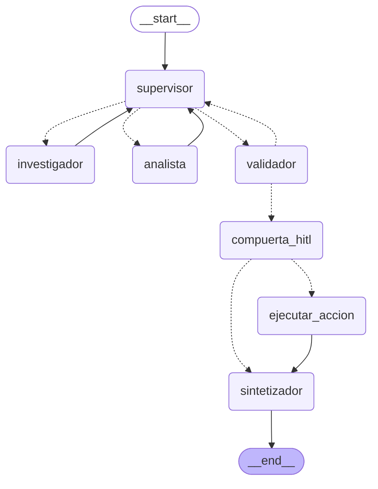

# Pre-entrega 7 — API de producción y monitoreo activo

API REST en **FastAPI** que expone el orquestador multi-agente de la
Pre-entrega 6, con cuatro capacidades nuevas:

- **Endpoints asíncronos**: `POST /tasks` encola y devuelve un `job_id` en
  milisegundos. Ningún endpoint espera al agente.
- **Estado en Redis**: el registro de cada job y los checkpoints de LangGraph,
  con transición explícita a `FALLIDO` ante cualquier excepción.
- **Observabilidad activa**: una traza por ejecución en LangSmith, con el árbol
  de nodos del grafo, los tokens y el costo.
- **Human-in-the-loop**: el grafo se **pausa** antes de ejecutar una acción con
  efectos secundarios, y no sigue hasta que llega la aprobación por HTTP.

---

## Qué cumple del checklist

| Requisito | Dónde está | Verificado |
|---|---|---|
| Endpoint asíncrono que encola y devuelve `job_id` sin bloquear | [`app/main.py`](app/main.py) | 202 en **198-538 ms** con 5 jobs corriendo |
| Estado del job en Redis, incluido el paso a FALLIDO | [`app/jobs.py`](app/jobs.py) | Redis Cloud real + 18 tests |
| Trazas visibles en el dashboard | [`app/observability.py`](app/observability.py) | 60+ runs en LangSmith |
| Costo por ejecución y p95 de las 5 peticiones | [`screenshots/`](screenshots/) | **$0.0021/ejecución**, 5/5 completadas |
| Nodo HITL que pausa hasta la aprobación externa | [`app/hitl.py`](app/hitl.py) | escalación `ESC-3520FA32` creada solo tras aprobar |
| README con pasos y `requirements.txt` | este archivo | |
| Worker con manejo de errores en segundo plano | [`app/worker.py`](app/worker.py) | 4 tests de caminos de falla |

---

## El grafo

El orquestador del módulo 6 **se reutiliza, no se copia**:
[`app/graph.py`](app/graph.py) importa sus cinco nodos y le cambia el cableado
del final.

```
módulo 6:  validador --aprobado--> sintetizador
módulo 7:  validador --aprobado--> compuerta_hitl --> [ejecutar_accion] --> sintetizador
```



Se regenera con `python -c "from app.graph import diagrama_mermaid; print(diagrama_mermaid())"`.

---

## La arquitectura

```
   cliente                   FastAPI                  worker pool            Redis
      │                         │                          │                   │
      │  POST /tasks            │                          │                   │
      ├────────────────────────►│  crea el job ────────────────────────────────►│
      │                         │  put_nowait ────────────►│                   │
      │◄── 202 { job_id } ──────┤                          │                   │
      │                         │                          │ toma el job       │
      │  GET /tasks/{id}        │                          │ corre el grafo    │
      ├────────────────────────►│◄─────────── lee ─────────────────────────────┤
      │◄── EJECUTANDO ──────────┤                          │ checkpoints ─────►│
      │                         │                          │                   │
      │                         │                          │ interrupt()       │
      │  GET /tasks/{id}        │                          │ suelta el job     │
      ├────────────────────────►│                          │                   │
      │◄── ESPERANDO_APROBACION │                          │                   │
      │    + propuesta          │                          │                   │
      │                         │                          │                   │
      │  POST /{id}/approve     │                          │                   │
      ├────────────────────────►│  Command(resume) ───────►│ retoma del        │
      │◄── 200 ─────────────────┤                          │ checkpoint ◄──────┤
      │                         │                          │ ejecuta la acción │
      │  GET /tasks/{id}        │                          │                   │
      ├────────────────────────►│                          │                   │
      │◄── COMPLETADO + informe │                          │                   │
```

---

## Decisiones de diseño

### Por qué una cola y no `BackgroundTasks`

`BackgroundTasks` de FastAPI dispara la tarea sin ningún límite: 50 peticiones
simultáneas son 50 grafos corriendo a la vez y 50 veces la cuota del modelo
consumida en paralelo. No hay contrapresión ni forma de saber cuánto trabajo
hay pendiente.

Con una `asyncio.Queue` acotada y un número fijo de workers:

- La concurrencia tiene techo (`CANTIDAD_WORKERS`, por defecto 3).
- La cola tiene techo: al llenarse, la API responde **503 con `Retry-After`**
  en lugar de aceptar trabajo que no va a poder atender.
- `queue.qsize()` es una métrica real de saturación, que `/health` expone.

### Ningún job queda colgado

Es la invariante que organiza [`app/worker.py`](app/worker.py). Un cliente que
hace polling necesita que el job llegue a un estado terminal **siempre**. Tres
mecanismos:

1. El worker atrapa `BaseException`, no `Exception`. Un `CancelledError` por
   apagado del proceso también deja el job en un estado legible.
2. Hay un **timeout por job** (300 s): un grafo colgado termina en `FALLIDO` en
   lugar de ocupar un worker para siempre.
3. `task_done()` va en un `finally`, para que el contador de la cola no quede
   roto si algo falla en el medio.

Hay cuatro tests que lo verifican, incluido uno que lanza seis jobs contra un
grafo que falla de tres formas distintas y comprueba que ninguno quede en
`EJECUTANDO`.

### El worker suelta el job durante la pausa HITL

Cuando el grafo se interrumpe, el job pasa a `ESPERANDO_APROBACION` y el worker
**vuelve a la cola**. No se queda esperando a la persona.

Si lo hiciera, una aprobación que tarda una hora ocuparía un worker una hora, y
con tres workers bastarían tres pausas simultáneas para que el servicio deje de
atender. El estado vive en el checkpoint de Redis, así que retomar no necesita
que nadie lo haya estado sosteniendo en memoria.

### Qué se considera una acción crítica

El orquestador del módulo 6 era de solo lectura. Esta entrega le agrega
`escalar_a_guardia`, que abre una escalación y despierta a la persona de turno.

La definición operativa de crítico es **efecto externo e irreversible**, no "el
LLM cree que es importante". Y la decisión es **determinista**:
`evaluar_criticidad()` no usa LLM — mira los hallazgos del analista y aplica
una regla (hay un atípico de severidad crítica, o uno que superó las dos horas
de caída).

Las razones son las mismas por las que el validador del módulo 6 tampoco usa
LLM: un modelo al que se le pregunta "¿esto es crítico?" responde distinto
según cómo venga redactado el contexto, y la compuerta que decide si hace falta
aprobación humana no puede depender de eso. Lo que el LLM sí hace es redactar
el motivo que lee la persona que aprueba — eso es texto, no control de flujo.

Hay un test (`test_un_atipico_leve_no_dispara_la_aprobacion`) que verifica que
la compuerta **no** se dispare de más. Si pidiera aprobación para todo, la
gente aprobaría sin leer y el control dejaría de servir.

### El efecto secundario es verificable

`escalar_a_guardia` escribe la escalación en Redis. No es un `print` que simula
haber hecho algo: después de aprobar, `GET /escalaciones` la devuelve, con su
id de seguimiento y quién la autorizó.

Si no hay Redis, la acción **falla** en vez de devolver un éxito que no
ocurrió. Un sistema que dice "escalé" sin haber escalado es peor que uno que
avisa que no pudo.

### Redis y no SQLite

El módulo 6 usaba `AsyncSqliteSaver`. Para una API no alcanza:

- **Varios procesos.** Un `uvicorn --workers 4` son cuatro procesos que
  competirían por el mismo archivo.
- **El estado sobrevive al deploy.** Un job pausado esperando aprobación tiene
  su estado en el checkpointer; si es un archivo del contenedor, el próximo
  deploy lo borra.
- **La pausa puede durar.** El HITL implica que un grafo quede detenido minutos
  u horas.

### Limitador de tasa: lo que encontró la primera prueba de carga

La primera corrida de las 5 peticiones concurrentes terminó con **3 de 5 jobs
en `FALLIDO` por 429 RESOURCE_EXHAUSTED**. El sistema se comportó como debía
—los tres fallos quedaron en Redis con su error, que es exactamente lo que pide
la consigna— pero un informe que no se produce no le sirve a nadie.

Cinco grafos concurrentes son ~50 llamadas al proveedor por minuto, y el free
tier de Gemini permite muy pocas. Un límite de tasa del proveedor no es un caso
excepcional: es una condición permanente de cualquier API que dependa de un
tercero.

[`app/llm.py`](app/llm.py) agrega dos piezas:

- **`InMemoryRateLimiter`**, un token bucket compartido por todo el proceso.
  Reparte las llamadas en el tiempo sin importar cuántos grafos corran: es
  preventivo, evita el 429 en vez de recuperarse de él.
- **`max_retries=6`** con backoff exponencial, para lo que igual rebote.

Resultado: **5 de 5 completadas, cero fallos.**

Se define en esta entrega y **no se toca el módulo 6**: el modelo se inyecta en
los agentes durante el arranque de la app. Es inyección de dependencias en el
punto de composición — el módulo 6 define *qué* hacen los agentes, y el entorno
que los ejecuta decide *con qué modelo*.

### Un modelo concreto, no un alias

`MODELO_GEMINI_API=gemini-3.1-flash-lite` en vez de
`gemini-flash-lite-latest`, y la razón es la atribución de costos.

LangSmith deriva el costo de los tokens usando una tabla de precios indexada
por nombre de modelo. Esa tabla tiene entradas para los nombres concretos pero
**no para los alias**: con el alias, las trazas llegan con los tokens bien
contados y el costo en blanco. Se verificó consultando su
`/api/v1/model-price-map`: hay 29 entradas de Gemini, ninguna matchea un
`-latest`.

Es además lo correcto para producción: un alias cambia de modelo sin aviso, y
con él cambian la latencia, la calidad y el precio.

### El span raíz por job

LangChain y LangGraph ya emiten eventos de callback en cada paso, así que con
`LANGSMITH_TRACING=true` los nodos y las herramientas se exportan solos sin
decorar nada. Decorar cada nodo duplicaría spans.

Lo que sí hace falta es un **span raíz por job** (`@traceable` sobre
`ejecutar_job`). Sin él, un job que se pausó para aprobación y se retomó
después queda partido en dos trazas sin relación visible.

---

## Estructura

```
pre-entrega-7/
├── app/
│   ├── main.py            # FastAPI: endpoints y ciclo de vida
│   ├── graph.py           # orquestador del M6 + RedisSaver + nodos HITL
│   ├── worker.py          # cola, pool de workers, red de contención
│   ├── jobs.py            # estado de los jobs en Redis
│   ├── hitl.py            # criticidad, interrupt() y ejecución de la acción
│   ├── acciones.py        # las operaciones con efectos secundarios
│   ├── observability.py   # LangSmith (o Phoenix)
│   ├── llm.py             # modelo con limitador de tasa y reintentos
│   ├── schemas.py         # contratos de la API y del estado
│   └── config.py          # configuración, sin efectos al importar
├── scripts/
│   └── prueba_de_carga.py # las 5 peticiones concurrentes
├── tests/
│   ├── test_api.py        # 18 tests, sin Redis real ni API keys
│   └── stub_llm.py        # puente al LLM guionado del módulo 6
├── screenshots/           # capturas del dashboard + README de qué capturar
├── Dockerfile
├── docker-compose.yml
├── requirements.txt
├── .env.example
└── README.md
```

---

## Cómo levantarlo

### 1. Dependencias

```bash
# desde la raíz del repo
python -m venv venv
.\venv\Scripts\Activate.ps1      # Windows (PowerShell)
# source venv/bin/activate       # Mac/Linux

pip install -r pre-entrega-7/requirements.txt
```

Probado con Python 3.14; requiere 3.12 o superior.

### 2. Redis

El checkpointer de LangGraph necesita **Redis con el módulo RediSearch**. Un
`apt install redis-server` pelado **no alcanza**: la API arranca, acepta
trabajos y todos fallan en el primer checkpoint.

Dos caminos:

**Redis Cloud (gratis, sin instalar nada)** — es con lo que se desarrolló esta
entrega:

1. https://redis.io/try-free → creá una base (30 MB, sin tarjeta).
2. Botón **Connect** → **Redis client** → **Python**: te da la URL completa.
3. Pegala en el `.env` de la raíz como `REDIS_URL=redis://default:...`

**Docker**:

```bash
cd pre-entrega-7
docker compose up -d redis     # imagen redis/redis-stack-server, ya trae RediSearch
# y en el .env:  REDIS_URL=redis://localhost:6379
```

### 3. Variables de entorno

Copiá [`.env.example`](.env.example) al `.env` de la **raíz del repo** y
completá. Lo mínimo:

```bash
REDIS_URL=redis://default:...
LANGSMITH_API_KEY=lsv2_pt_...
LANGSMITH_PROJECT=auditoria-multiagente
PROVIDER=gemini
GEMINI_API_KEY=...
MODELO_GEMINI_API=gemini-3.1-flash-lite
```

El `.env` está en `.gitignore`.

### 4. Levantar la API

```bash
cd pre-entrega-7
uvicorn app.main:app --port 8000 --reload
```

Documentación interactiva en http://127.0.0.1:8000/docs

Verificá que arrancó bien:

```bash
curl http://127.0.0.1:8000/health
# {"estado":"ok","redis":true,"observabilidad":"langsmith:auditoria-multiagente",
#  "jobs_en_cola":0,"workers":3,"detalle":""}
```

### 5. Con Docker (todo junto)

```bash
cd pre-entrega-7
docker compose up --build
```

---

## Cómo probarlo

### Una auditoría completa, con aprobación

```bash
# 1. Encolar
curl -X POST http://127.0.0.1:8000/tasks \
  -H "Content-Type: application/json" \
  -d '{"solicitud": "Nuestros servicios asincronicos se vienen cayendo. Que dice la documentacion sobre las causas y que muestran nuestros incidentes del ultimo anio?"}'
# -> 202 {"job_id":"efc1a7fecc034cc2","estado":"PENDIENTE","url_estado":"/tasks/efc1a7fecc034cc2"}

# 2. Consultar hasta que pida aprobación
curl http://127.0.0.1:8000/tasks/efc1a7fecc034cc2
# -> {"estado":"ESPERANDO_APROBACION","requiere_aprobacion":true,
#     "propuesta":{"accion":"escalar_a_guardia","criticidad":"critica",
#                  "motivo":"El incidente INC-0214 del servicio api-pagos acumulo 480 minutos...",
#                  "efectos":["Abre una escalacion...","Notifica a la persona de guardia..."]}}

# 3. Aprobar
curl -X POST http://127.0.0.1:8000/tasks/efc1a7fecc034cc2/approve \
  -H "Content-Type: application/json" \
  -d '{"aprobado": true, "aprobado_por": "mariana", "comentario": "Confirmado."}'

# 4. El informe final
curl http://127.0.0.1:8000/tasks/efc1a7fecc034cc2
# -> {"estado":"COMPLETADO","informe":"...","accion_ejecutada":{"escalacion_id":"ESC-3520FA32",...}}

# 5. El efecto, verificable
curl http://127.0.0.1:8000/escalaciones
```

Para ver que rechazar **no** ejecuta nada, mandá `{"aprobado": false, ...}` en
el paso 3 y mirá que `/escalaciones` siga sin esa entrada.

### Las 5 peticiones concurrentes

```bash
python scripts/prueba_de_carga.py --aprobar --json screenshots/resultado-prueba-de-carga.json
```

Después, las capturas del dashboard: las instrucciones exactas de qué y dónde
están en [`screenshots/README.md`](screenshots/README.md).

### Los tests

```bash
python -m pytest tests/ -v
```

18 tests, ~3 segundos, **sin Redis real, sin red y sin ninguna API key**:

```bash
REDIS_URL= GEMINI_API_KEY= LANGSMITH_API_KEY= python -m pytest tests/ -q
```

---

## Resultado de la prueba de carga

5 peticiones concurrentes, 3 workers, aprobación automática de las pausas HITL:

```
 #  estado                    202 en     total  hitl
 1  COMPLETADO              198.7 ms   99.11 s  sí
 2  COMPLETADO              519.5 ms  142.55 s  sí
 3  COMPLETADO              538.3 ms  150.78 s  sí
 4  COMPLETADO              491.6 ms    94.8 s  sí
 5  COMPLETADO              537.5 ms  130.78 s  sí

completadas: 5/5   fallidas: 0   pausadas en HITL: 5
corrida completa: 150.78 s

Latencia extremo a extremo (incluye espera en cola):
  p50=138.17 s   p95=149.13 s
Tiempo hasta el 202 (la API no bloquea):
  p50=519.5 ms   p95=538.14 ms   max=538.3 ms
```

Lo que importa de esta tabla: **el 202 llegó en medio segundo mientras cinco
auditorías corrían en paralelo**. Esa es la diferencia entre encolar y ejecutar
dentro del request.

Del dashboard de LangSmith:

| Métrica | Valor |
|---|---|
| Costo por ejecución | **$0.001953 – $0.002192** (media ~$0.0021) |
| Tokens por ejecución | 5.436 – 6.169 |
| Modelo | `gemini-3.1-flash-lite` |
| Spans con costo atribuido | 13/13 |
| Latencia P50 | 28,64 s |
| **Latencia P95** | **84,46 s** |
| Latencia P99 | 115,60 s |

#### De dónde sale el P95

El panel **Trace Latency** de LangSmith grafica los percentiles de latencia,
pero en su versión actual dibuja **P50 y P99**, no P95
([`04-latencia-percentiles.png`](screenshots/04-latencia-percentiles.png)).

El P95 se calculó por interpolación lineal sobre las **mismas 33 trazas que
LangSmith tiene registradas**, leídas con su propia API
(`client.list_runs`). No es una medición aparte: es el mismo conjunto de datos
del gráfico, con otro percentil. La verificación es que el P50 calculado
—28,64 s— coincide exactamente con el que muestra el panel.

El cálculo se reproduce con:

```bash
python scripts/percentiles_langsmith.py
```

#### Los dos p95 miden cosas distintas

| | qué mide | valor |
|---|---|---|
| **P95 de LangSmith** | la ejecución del grafo, desde que un worker toma el trabajo | 84,46 s |
| **P95 del script** | de punta a punta, incluyendo la espera en cola | 149,13 s |

Conviene leerlos juntos: la diferencia entre los dos **es** el tiempo de cola.
Con 3 workers y 5 peticiones, dos esperan turno, y esos ~65 segundos de
diferencia son exactamente esa espera. Si los dos números fueran parecidos, la
cola no estaría siendo un cuello de botella.

---

## Limitaciones conocidas

- **`RedisSaver` no está cubierto por los tests.** `fakeredis` no emula
  RediSearch, que es lo que el checkpointer necesita. Los tests usan el
  checkpointer en memoria; la verificación de la persistencia en Redis se hizo
  **a mano contra una base de Redis Cloud real**, y está documentada arriba.
  Cubrirla automáticamente requeriría levantar un contenedor en CI.

- **El worker vive en el proceso de la API.** La consigna lo permite
  explícitamente ("puede ser un thread asíncrono simple"). Para producción de
  verdad el paso siguiente es Celery o Arq con un broker, lo que permitiría
  escalar workers aparte de la API y sobrevivir a un reinicio sin perder los
  jobs en `PENDIENTE`.

- **El limitador de tasa es por proceso.** `InMemoryRateLimiter` reparte las
  llamadas dentro de un proceso. Con varias instancias de la API, cada una
  tendría su propio presupuesto y entre todas podrían pasarse del límite del
  proveedor. La solución sería un limitador distribuido sobre el mismo Redis.

- **El proveedor es Gemini, no OpenAI ni Anthropic.** Es la única API key con
  cupo disponible. El código soporta los tres vía `PROVIDER` sin cambiar una
  línea. Es la observación que viene de la Pre-entrega 5 y sigue pendiente por
  falta de una key con crédito.

- **La notificación de la escalación está simulada.** La escritura en Redis es
  real y verificable; el aviso a la guardia no se manda a ningún lado. El
  propio registro lo declara en el campo `notificacion`, para que nadie lo lea
  como si se hubiera notificado a alguien.

- **Un job cancelado por apagado queda en `FALLIDO`.** Es honesto pero no
  ideal: lo correcto sería devolverlo a la cola para que otro worker lo retome.
  Requiere una cola persistente, que es el mismo paso que Celery/Arq.
